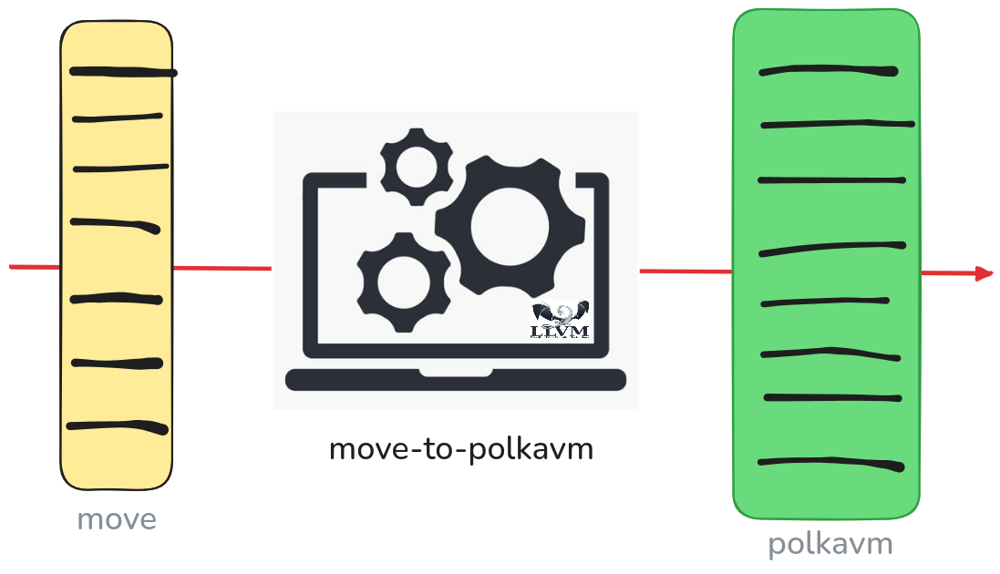

# Move Language support in PolkaVM

Move is a statically-typed programming language designed for safe and flexible smart contract development, with a strong focus on digital asset management.
It uses a resource-oriented model that enforces ownership and prevents assets from being accidentally copied or lost, making it ideal for secure blockchain applications.
Move was originally developed at Facebook.

PolkaVM is a lightweight virtual machine designed to execute smart contracts within the Substrate-based Polkadot ecosystem.
It serves as the execution layer for runtime logic and smart contracts on parachains, enabling decentralized applications while maintaining interoperability, security, and upgradeability across the Polkadot network.

This project adds support to execute smart contracts written in Move on PolkaVM.

## Getting started

This project relies heavily on [LLVM](https://llvm.org/) and just requires installing the necessary developer tools.

```bash
# Ubuntu
sudo apt install libpolly-19-dev lld-19 libzstd-dev
```

```bash
# Fedora
dnf install llvm-devel
```

```bash
# MacOS
brew install llvm@19
```

Even though LLVM itself is written in C++, we use Rust, especially [llvm-sys](https://crates.io/crates/llvm-sys).

Install Rust:

```bash
curl --proto '=https' --tlsv1.2 -sSf https://sh.rustup.rs | sh
```

Build the `move-to-polka` tool:

```bash
cargo build --release
```

## Architecture

On a high level, we use a stackless version of Move byte-code and compile it down to RISC-V machine instructions.
Then, we use the PolkaVM linker to convert the ELF file into a PolkaVM file.
These steps all happen offline.

The PolkaVM file can then be loaded and executed inside a PolkaVM.

## Troubleshooting

If you get an error related to

```
error: No suitable version of LLVM was found system-wide or pointed
              to by LLVM_SYS_191_PREFIX
```

Try using

```bash
export LLVM_SYS_191_PREFIX="/usr/local/opt/llvm@19"
```

## Basic usage

The main crates for this repo are:

- `move-to-polka` crate, which is the actual Move to PolkaVM compiler
- `polkavm-wrapper` crate allows loading a compiled polkavm module and calls the provided "entry" function with the provided args for convenience.

### `move-to-polka` installation and usage

Install `move-to-polka` binary:

```bash
cargo install --path crates/move-to-polka
```

Compile the given move source file into a PolkaVM module (`output.polkavm` by default):

```bash
move-to-polka examples/basic/sources/morebasic.move
```

### `polkavm-wrapper` installation and usage

Install `polkavm-wrapper` binary:

```bash
cargo install --path crates/polkavm-wrapper
```

You can now run the compiled module:

```bash
polkavm-wrapper -m output.polkavm -e vecnew
```

The `polkavm-wrapper` can now also compile the given Move source and link with the Move stdlib and all native functions in one go.

```bash
polkavm-wrapper -s examples/basic/sources/vector.move -e vecnew
```

The expected output:

```bash
2025-06-10T22:24:29.519797Z  INFO polkavm_wrapper: Compiled Move source to PolkaVM bytecode at /tmp/output.polkavm
2025-06-10T22:24:29.730200Z  INFO move_to_polka::linker: RO: 10000 size 8192
2025-06-10T22:24:29.730215Z  INFO move_to_polka::linker: AUX: FFFE0000 size: 4096
2025-06-10T22:24:29.730565Z  INFO polkavm_wrapper: Calling entry point vecnew at PC 1056 with args: []
2025-06-10T22:24:29.731210Z  INFO move_to_polka::linker: debug_print called. type ptr: 0x10080 Data ptr: 0xFFFCFFC0, type: "MoveType { type: Vector }", value: MoveByteVector { ptr: 0xfffe0008, capacity: 16, length: 11 }, bytes: [0, 1, 2, 3, 4, 5, 6, 7, 8, 9, 10]
2025-06-10T22:24:29.731256Z  INFO move_to_polka::linker: debug_print called. type ptr: 0x100B0 Data ptr: 0xFFFCFFF0, type: "MoveType { type: U64 }", value: 2
2025-06-10T22:24:29.731265Z  INFO polkavm_wrapper: Result: 2
```

### Known limitations:

- Move project layout is not supported yet, only single Move file -> PolkaVM module compilation.
- `polkavm-wrapper` can only call functions with maximum two u64 arguments and assumes the entrypoint returns u64 too. This is due to the generic API of the PolkaVM
  which makes it hard or impossible to handle dynamically with a CLI (as the argument types and return types need to be known at compile time).

## History

This repository was forked from [anza-xyz/move](https://github.com/anza-xyz/move), which added Move support to Solana.

## About [Eiger](https://www.eiger.co)

We are engineers. We contribute to various ecosystems by building low-level implementations and core components. We believe in Move and in Polkadot and wanted to bring them together. Read more about this project on [our blog](https://www.eiger.co/blog/eiger-brings-move-to-polkadot).

Contact us at hello@eiger.co
Follow us on [X/Twitter](https://x.com/eiger_co)
