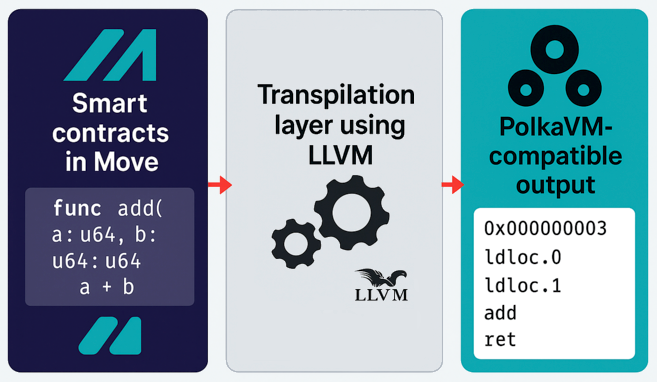

# Move Language support in PolkaVM

Move is a statically-typed programming language designed for safe and flexible smart contract development, with a strong focus on digital asset management.
It uses a resource-oriented model that enforces ownership and prevents assets from being accidentally copied or lost, making it ideal for secure blockchain applications.
Move was originally developed at Facebook.

PolkaVM is a lightweight virtual machine designed to execute smart contracts within the Substrate-based Polkadot ecosystem.
It serves as the execution layer for runtime logic and smart contracts on parachains, enabling decentralized applications while maintaining interoperability, security, and upgradeability across the Polkadot network.

This project adds support to execute smart contracts that are written in Move on PolkaVM.

## Getting started

This project relies heavly on [LLVM](https://llvm.org/) and just must install the necessary developer tools.

```
# MacOS
brew install llvm@19
```

```
# Fedora
dnf install llvm-devel
```

Even if llvm itself is written in C++, we use Rust and especially [llvm-sys](https://crates.io/crates/llvm-sys).

Install Rust
```
curl --proto '=https' --tlsv1.2 -sSf https://sh.rustup.rs | sh
```

And build the move-to-polkavm tool

```
cargo build --release
```

## Architecture

On a high level, we use a stackless version of Move byte-code and compiles it down to Risc-V machine instructions.
Then, we use the polkavm linker to covert the elf file into a polkavm file.
These steps all happens offline.

The polkavm file can then be loaded an run inside a PolkaVM.

## History

This repository was forked from [anza-xyz/move](https://github.com/anza-xyz/move) that added Move support to Solana.

## Troubleshooting

If you get an error related to

```
error: No suitable version of LLVM was found system-wide or pointed
              to by LLVM_SYS_191_PREFIX
```

Try using

```
export LLVM_SYS_191_PREFIX="/usr/local/opt/llvm@19"
```

## Basic usage

The main crates for this repo are:

- move-to-polka crate, which is actual move to polkavm compiler
- polkavm-wrapper crate, which allows to load compiled polkavm module and calls provided "entry" function with provided args for convience.

### move-to-polka installation and usage

```bash
cargo install --path language/polkavm/move-to-polka
```

Will install move-to-polka binary accessible from terminal.

```bash
 move-to-polka language/polkavm/examples/basic/sources/morebasic.move
 ```
 Will compile given move source file into polkavm module (output.polkavm by default)

 ### polkavm-wrapper installation and usage
 ```bash
 cargo cargo install --path language/tools/polkavm-wrapper
 ```

 Will install polkavm-wrapper binary accessible from terminal

 ```bash
 polkavm-wrapper -m output.polkavm -e sum -p 100 10
 ```

 Will call previously compiled module's entry function sum with given args and will produce:

 ```bash
2025-05-06T06:55:13.223390Z  INFO polkavm_wrapper: Reading output.polkavm module
2025-05-06T06:55:13.223708Z  INFO polkavm_wrapper: 64bit module?: false
2025-05-06T06:55:13.223712Z  INFO polkavm_wrapper: Calling sum with args [100, 10]
2025-05-06T06:55:13.223791Z  INFO polkavm_wrapper: VM finished
2025-05-06T06:55:13.223793Z  INFO polkavm_wrapper: Result = 110
 ```

 ### Known limitations:

 - Only SINGLE move module compilation is supported for now , if two modules in single file are detected, it will give an error.
 - Move project layout not supporte yet, only single move file -> polkavm module compilation
 - No native function support yet (meaning that module compiles, but polka linking phase will fail even with basic operation like division because it will emit abort native function call as part of post check)
 - No std move lib yet (requires multi module compilation)
 - polkavm-wrapper assumes that all entry function args are u64 (and therefore passed through two riscv 32bit registers) and return value is also u64 (returned through two riscv 32bit registers). This limitation can be lifted later, when more complex data as args support will be added